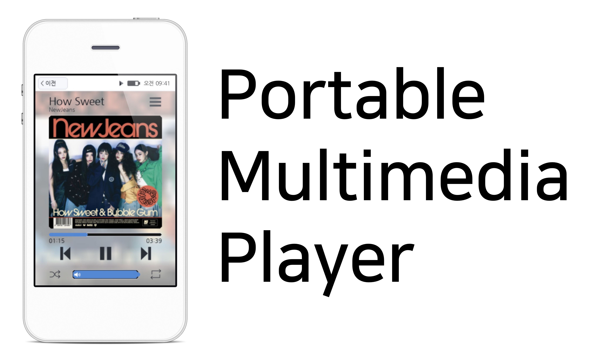

# MP3 Player


## ✨ 주요 기능
- 홈 런처 UI 및 앱 전환
- 음악 앱: 재생 목록, 앨범/아티스트/장르 분류, 메타데이터 기반 표시
- 비디오 앱: 목록/플레이어, 진행바 및 볼륨 제어
- 사진 앱: 뷰어, 공유/삭제(휴지통 이동), 메타데이터 처리
- 텍스트 뷰어: `.txt` 파일 목록 및 읽기
- 파일 앱: 내부 저장소/휴지통 탐색, 선택/삭제/복원
- 설정: 언어, 화면 모드, 밝기, 소리, 블루투스(모의), 배경화면/강조색 등
- 잠금 화면 및 부팅 시퀀스

## 📂 데이터 구조
- `main.py`: 메인 애플리케이션 엔트리
- `system/`: UI 에셋, 아이콘, 폰트, 언어팩, 설정 파일
- `files/`: 사용자 콘텐츠 폴더(음악/비디오/사진/문서)

## 📦 요구 사항
- Python 3.10+
- Pygame
- Mutagen
- Pillow
- (권장) ffmpeg / ffplay / mpv

## 🚀 빠른 시작

### macOS
```bash
./install_dependencies_mac.command
source .venv/bin/activate
python main.py
```

### Debian / Ubuntu
```bash
./install_dependencies_debian.sh
source .venv/bin/activate
python main.py
```

### Windows (CMD)
```bat
install_dependencies_windows.bat
call .venv\Scripts\activate.bat
python main.py
```

## 🌐 언어팩
- 언어팩 위치: `system/lang/`
- 기본 제공: `ko-kr.json`, `en-us.json`, `ja-jp.json`
- 사용자 정의: `custom.json`

언어 설정에서 `사용자 정의`를 선택하면 `system/lang/custom.json`이 로드됩니다.

## 💡 실행 팁
- `ESC` 키를 전원 버튼으로 사용합니다. (짧게 눌러 화면 끄기/켜기, 길게 눌러 전원 메뉴)
- 미디어 파일은 아래 폴더에 넣으면 앱에서 자동으로 인식됩니다.
  - 음악: `files/music`
  - 비디오: `files/video`
  - 사진: `files/image`
  - 문서: `files/document`
- 휴지통 메타데이터는 `files/.trash/meta/data.json`을 사용합니다.

## ⚠️ 주의 사항
- 이 프로젝트는 로컬 오프라인 환경을 기준으로 설계되었습니다.
- OS/환경에 따라 `ffmpeg`, `mpv` 설치 여부에 따라 일부 기능이 제한될 수 있습니다.
- HVGA와 터치에 최적화 되어 있습니다.

## 📸 Preview


## 🚧 구현 예정 기능
- 완벽한 천지인
- 잠금화면 암호
